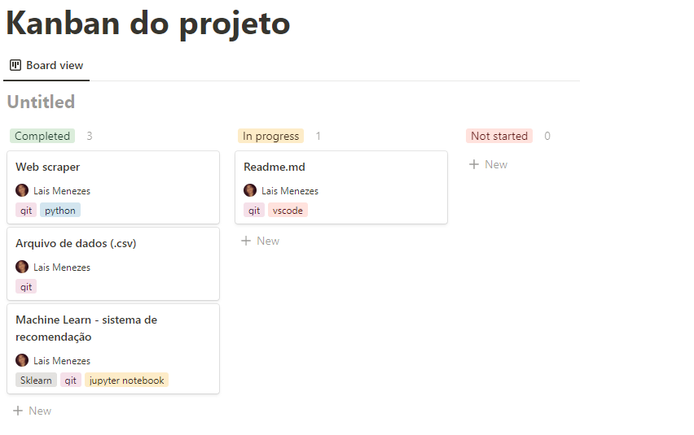
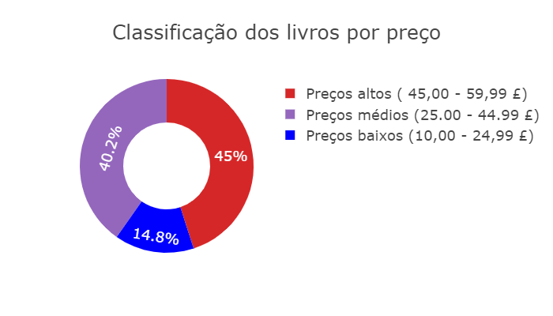
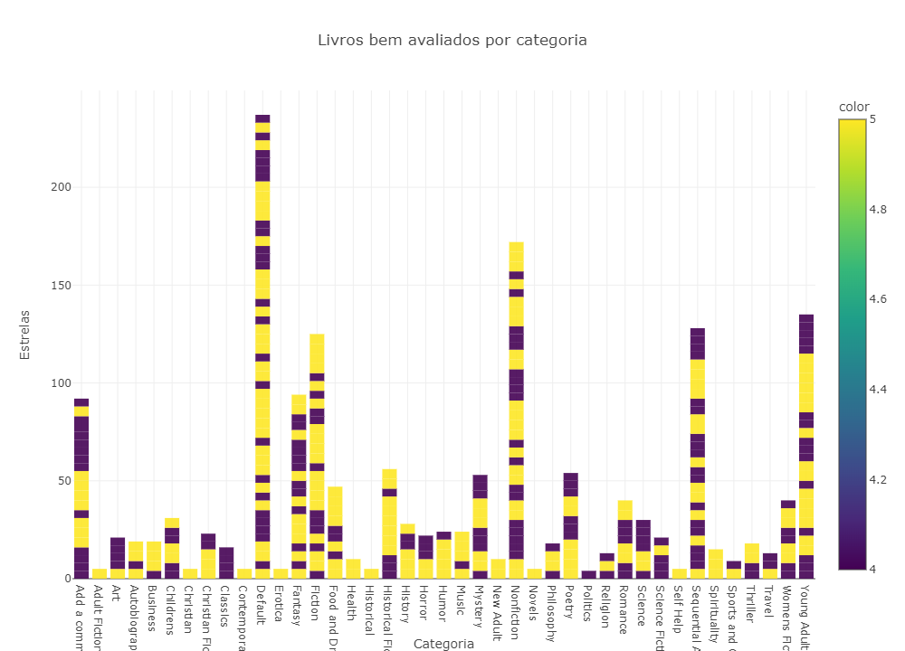
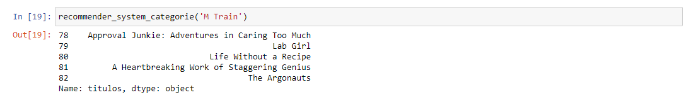
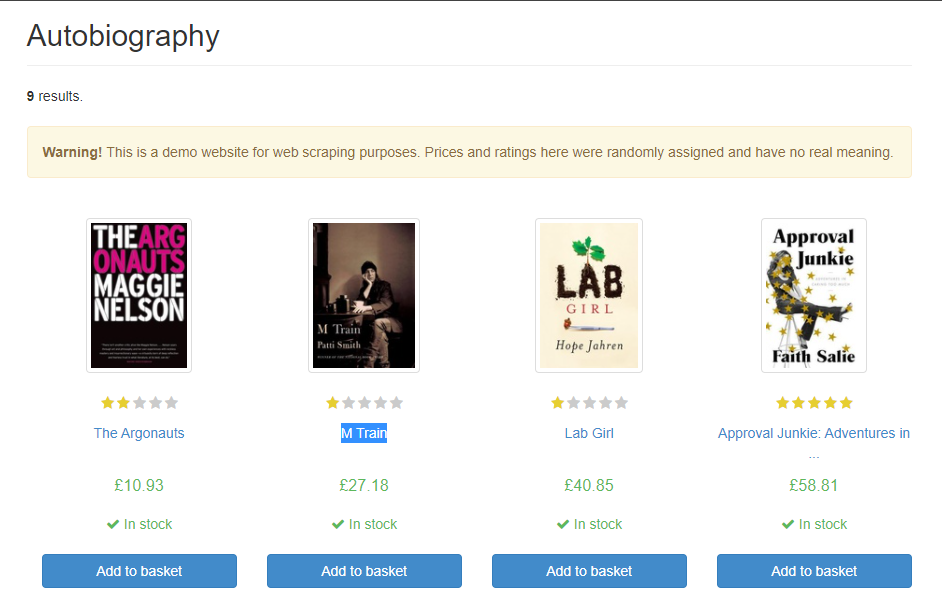

<h1> Sistema de Recomendação por Conteúdo - Book Club</h1>

 
<a href = '#description'>Sobre</a> •
<a href = '#tecnologies'>Tecnologias e IDEs</a> •
<a href = '#roadmap'>Roadmap</a> •
<a href = '#conclusion'>Conclusão</a> •
<a href = '#author'>Autor</a>

<h2 id = 'description'> Sobre </h2>

Este projeto foi idealizado para a criação de um Sistema de Recomendação de livros em uma <a href='http://books.toscrape.com/'>BookClub</a> com base em categorias similares aos que foram previamente buscados pelos usuários.

<h2 id = 'tecnologies'> Tecnologias e IDEs </h2>

Linguagem de programação: 
<a href='https://www.python.org'>Python</a>

Bibliotecas:  
1. Selenium (testa aplicação web de forma automatizada); 
2. BeautifulSoup (análise de páginas e extração de dados HTML); 
3. Pandas (manipulação e análise de dados em tabelas numéricas e séries temporais); 
4. Plotly (visualização de dados por meio de gráficos); 
5. Scikit Learn (ferramenta de Machine Learning para análise preditiva de dados).

IDEs: 
<a href='https://code.visualstudio.com/'>VSCode</a> 
<a href='https://jupyter.org/'>Jupyter Notebook</a>

<h2 id = 'roadmap'>Roadmap</h2>

Organização:  
<a href='https://www.notion.so/'>Notion</a> 
<figure>
  
</figure>

1. <b>Web Scraping - VSCode </b>  
  
Inicialmente, a utilização da biblioteca <b>Selenium</b> necessita do download de um driver <a href='https://chromedriver.chromium.org/downloads'>chromedriver</a> para navegação entre as páginas, a automação vai de página por página e faz a requisição da 'url' de cada livro. Após esse processo, cada um dos endereços é acessado e a biblioteca <b>BeautifulSoup</b> recolhe os dados necessários de cada livro: títulos, categorias, preços, avaliaçõe e estocagem. Por fim, com a biblioteca <b>Pandas</b> é criado um DataFrame e o arquivo com tais dados é salvo em formato '.csv' para uso posterior.

 2. <b>Manipulação e análise de dados - Jupyter Notebook</b> 

Faz-se a transferência do arquivo '.csv' para o Notebook, retiramos e substituímos caracteres especiais das colunas de preços e avaliações, além de alterar os dados das colunas de avaliações de 'strigs' para 'float' e 'int'.  

Após a reorganização do dataframe cria-se a primeira análise, tendo como ponto de partida o preço médio, máximo e mínimo. Desse modo, define-se três faixas para o gráfico de torta (Pie Chart) com a biblioteca <b>Plotly</b>: 
45,00 até 59,99 £ --> Preços altos (faixa 1) 
25,00 até 45,00 £ --> Preços médios (faixa 2) 
10,00 até 25,00 £ --> Preços baixos (faixa 3) 
<figure>
  
</figure>

Já para as avaliações são levados em conta apenas livros com 4 ou 5 estrelas, definindo quais categorias se destacam por meio de um gráfico de barra (Bar Chart):
<figure>
  
</figure>

 3. <b>Criação de um Sistema de Recomendação por Conteúdo - Jupyter Notebook </b> 
  
Seleciona-se apenas as colunas que serão utilizadas: títulos, categorias e avaliações, para a criação do modelo de Machine Learning utiliza-se a biblioteca <b>Scikit Learn</b>. Dela fazemos uso do <b>TfidfVectorizer</b> que converterá nossa 'visão geral' (uma coluna de texto para as categorias) em numérica. O número de recursos  que ele cria é igual ao número total de palavras distintas na coluna escolhida, com o método cria-se assim uma matriz para a coluna. 

Após isso, utilizamos o <b>cosine_similarity</b> (cosseno similaridade) para criar uma medida de similaridade entre 2 vetores (a matriz criada anteriormente), essa medida é o cosseno do ângulo entre eles. A função linear_kernel criará uma matriz de similaridade. 

Cria-se uma série que mapeie (mapping) o índice da matriz para os nomes dos livros, isso facilita a alimentação dos nomes dos livros e obtém a recomendação. Por fim, define-se uma função em python de recomendação usando o cosine_similarity, a qual receberá o nome do livro e devolverá os 5 principais filmes recomendados.

<h2 id = 'conclusion'>Conclusão</h2>

O projeto em questão fez uso do Sistema de Recomendação por Conteúdo pois o site de armazenamento não possui a quantidade de avaliações dos usuários que seria uma alternativa para o uso de um Sistema Colaborativo, extremamente comum em sites como Netflix, Spotify etc. 
  
Nesse caso, o algoritmo definido para o Sistema de Recomendação com base na categoria do livro se mostrou eficiente, por meio da máquina preditiva foi feito um teste com o título de um livro <b>'M Train'</b> e o mesmo retornou outros cinco de mesma categoria. 

<figure>
  
</figure> 

<figure>
  
</figure>

<h2 id = 'author'>Autor<h2>

Made by <a href='https://www.linkedin.com/in/lais-menezes-03533a150/'>Lais Menezes</a> 

